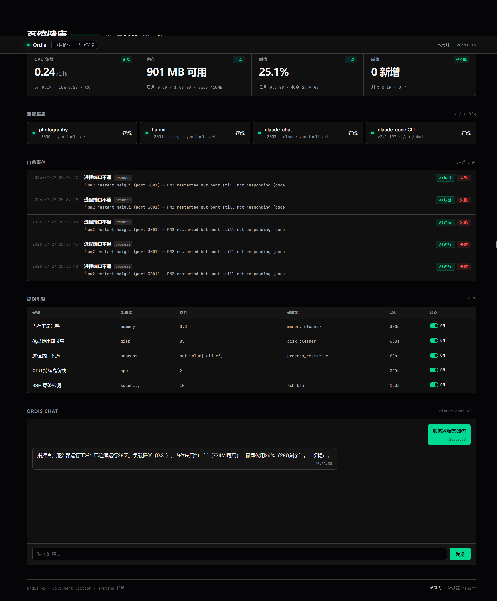

<p align="center">
  
</p>

# Ordis — 轻量自愈服务器守护进程

<p align="center">
  <strong>⚡ 50MB 内存 · 5 个采集器 · 4 个修复器 · AI 诊断</strong><br>
  <sub>一个会自己修自己的服务器守护进程。</sub>
</p>

<p align="center">
  <a href="#-what-is-ordis">English</a> ·
  <a href="#-ordis-是什么">中文</a>
</p>

---

## 🇬🇧 What is Ordis?

Ordis is a **lightweight self-healing daemon** that monitors your server and **automatically fixes problems** before you even notice.

> **Honest disclaimer:** Ordis is not a from-scratch monitoring giant. It's a pragmatic glue project — it **leverages PM2** for process management, **leverages Claude Code** for AI diagnosis, and wraps them in a clean architected loop: collect → evaluate → heal → log. The value is in the **architecture and integration**, not in reinventing wheels.

### Features

| Feature | How |
|---------|-----|
| **Auto-repair** | PM2/systemd restart, memory cleaning, disk cleanup, SSH auto-ban |
| **AI diagnosis** | Claude Code integration via chat — ask questions, get diagnosis |
| **50MB RAM** | Runs on a $5 VPS without breaking a sweat |
| **Plugin architecture** | Add collectors/healers without touching engine code |
| **YAML rules** | Human-readable rule definitions with cooldown |
| **Dark dashboard** | Real-time metrics, event timeline, rule management |
| **SSH defense** | Journald cursor-based incremental brute-force detection + ufw auto-ban |

### Dashboard

<p align="center">
  
  <br><sub>Real-time system metrics with expandable detail panels</sub>
</p>

### AI Chat

<p align="center">
  
  <br><sub>Claude Code integration — click "AI诊断" on failed events to auto-fill diagnostic questions</sub>
</p>

### Architecture

```
Ordis Daemon (30s loop)
├── Collectors (6)
│   ├── CPU    — load, usage, per-core
│   ├── Memory — available, swap, usage %
│   ├── Disk   — usage, free space
│   ├── Process — port health (TCP check)
│   └── Security — SSH brute-force (journald cursor)
├── Rule Engine
│   └── YAML-driven eval() expressions + cooldown
├── Healers (4)
│   ├── Process Restarter — PM2 + systemd dual
│   ├── Memory Cleaner   — flush caches + drop_caches
│   ├── Disk Cleaner      — apt clean + log rotation
│   └── SSH Ban           — ufw auto-block
└── Web Dashboard (FastAPI)
    ├── Live metrics (30s refresh)
    ├── Event timeline
    ├── Rule management
    └── Claude Code chat
```

### Compared to...

| Feature | Prometheus | Zabbix | Netdata | **Ordis** |
|---------|-----------|--------|---------|-----------|
| Auto-repair | ❌ | ❌ | ❌ | ✅ |
| AI diagnosis | ❌ | ❌ | ❌ | ✅ |
| RAM usage | 200MB+ | 500MB+ | 100MB+ | **50MB** |
| YAML rules | ✅ | ❌ | ❌ | ✅ |
| SSH defense | ❌ | ❌ | ❌ | ✅ |
| Deploy time | 30min | 60min | 5min | **30s** |

---

## 🇨🇳 Ordis 是什么？

Ordis 是一个**轻量的服务器自愈守护进程**。它每 30 秒扫描一次系统状态，发现问题后自动修复，不需要人工介入。

> **坦诚地说：** Ordis 不是一个从零造轮子的巨无霸。它是一个务实的胶水项目——**借用了 PM2** 管理进程，**借用了 Claude Code** 做 AI 诊断，然后把这些能力装进一个干净的架构里：采集 → 判断 → 修复 → 记录。核心价值在于**架构设计和集成能力**，而非重新发明已有的轮子。

### 快速开始

```bash
pip install -r requirements.txt
python3 ordisd.py once     # 跑一轮检查
python3 ordisd.py run      # 启动守护进程
sudo cp ordisd.service /etc/systemd/system/  # systemd 托管
```

### 规则示例

```yaml
rules:
  - name: "内存不足告警"
    collector: memory
    condition: "value['available_gb'] < threshold"
    threshold: 0.2
    healer: memory_cleaner
    cooldown: 300
```

### 生产数据

- 阿里云 ECS（1.6GB 内存，双核）
- 已连续运行 17 天
- 自动拦截 12 次 SSH 暴力破解
- 3 次自动服务重启（OOM 恢复）

### License

MIT
