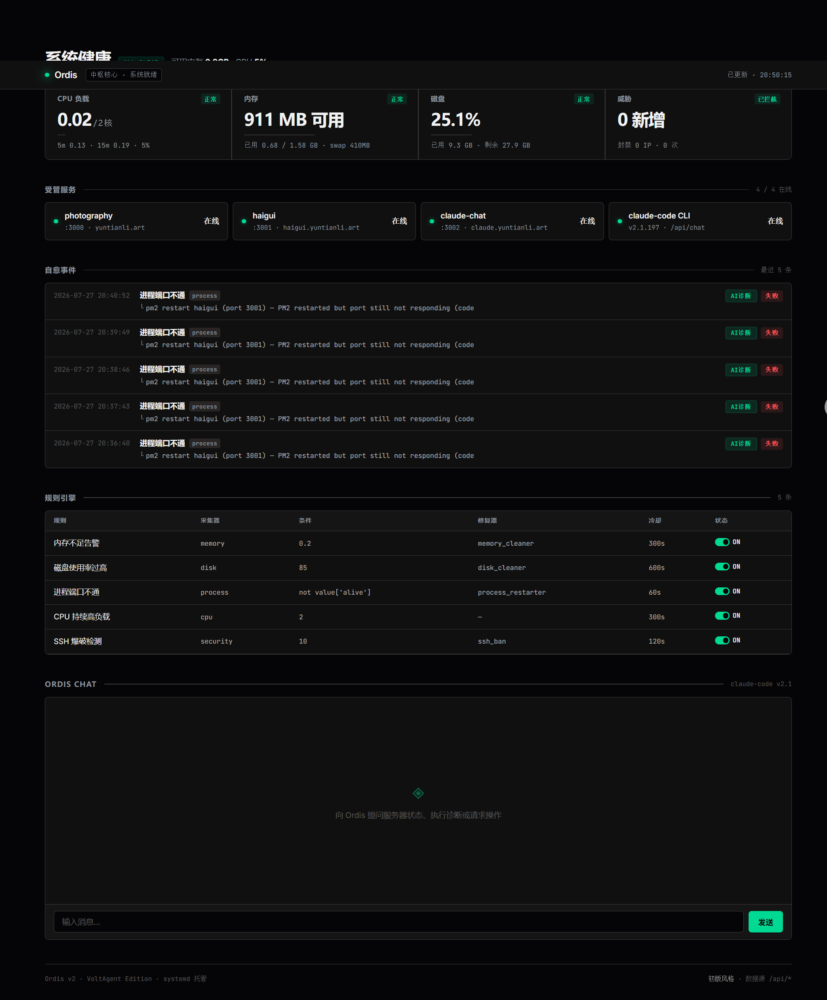

<p align="center">
  
</p>

# Ordis — 轻量运维自动化 · 服务器自愈守护进程

<p align="center">
  <strong>轻量主机检测 · Kubernetes 资源检测 · AI 诊断与受控修复</strong>
</p>

<p align="center">
  
  
  
  
  
  
</p>

<p align="center">
  <a href="#english">English</a> ·
  <a href="#中文">中文</a>
</p>

---

## English

### ⚠️ Status: Demo / Work in Progress

This is a **functional demo**, not a production-hardened tool. It runs on my personal server (Alibaba Cloud ECS, 1.6GB RAM) and handles real incidents. But there are sharp edges — error handling is minimal, there's no distributed mode, and configuration is file-based. **Use at your own risk. Contributions welcome.**

### What Problem Does It Solve?

Traditional monitoring tools (Prometheus, Zabbix, Netdata) are great at **telling you something broke**. Ordis tries to **fix it**.

- Server process crashes at 3 AM? Ordis restarts it.
- Memory creeping up? Ordis flushes caches.
- SSH brute-force attack? Ordis bans the IP.
- Weird failure you need AI to diagnose? Ordis calls Claude Code.

### Architecture Deep Dive

```
┌─────────────────────────────────────────┐
│              Ordis Daemon                │
│          (30-second loop)               │
├─────────────────────────────────────────┤
│                                         │
│  ┌──────────┐    ┌──────────┐           │
│  │ Collectors│───▶│  Engine  │           │
│  └──────────┘    └────┬─────┘           │
│       │               │                 │
│       │          ┌────▼─────┐           │
│       │          │  Healers  │          │
│       │          └────┬─────┘           │
│       │               │                 │
│  ┌────▼───────────────▼─────┐           │
│  │     Event Logger          │          │
│  └───────────────────────────┘          │
│                                         │
│  ┌───────────────────────────┐          │
│  │   Web Dashboard (FastAPI)  │          │
│  │   /api/status  /api/events │          │
│  │   /api/rules   /api/chat   │          │
│  └───────────────────────────┘          │
└─────────────────────────────────────────┘
```

#### Collectors (6)

| Collector | Source | Output |
|-----------|--------|--------|
| `cpu` | `psutil.cpu_percent()` | load_1min, load_5min, load_15min, cpu_percent |
| `memory` | `psutil.virtual_memory()` | available_gb, used_gb, total_gb, swap_used_gb, percent |
| `disk` | `shutil.disk_usage("/")` | use_pct, used_gb, free_gb |
| `process` | TCP socket connect | per-port alive/dead map |
| `security` | `journalctl` with cursor | failed SSH attempts, offending IPs, bans |

Each collector extends `BaseCollector` — just implement `collect()` and return a dict.

#### Rule Engine

```yaml
rules:
  - name: "进程端口不通"
    collector: process
    condition: "not all(value['ports'].values())"
    healer: process_restarter
    cooldown: 60
    enabled: true

  - name: "内存不足告警"
    collector: memory
    condition: "value['available_gb'] < threshold"
    threshold: 0.2
    healer: memory_cleaner
    cooldown: 300
```

Uses Python's `eval()` on collector output. Cooldown prevents thrashing.

#### Healers (4, with port re-check)

| Healer | Action | Verifies? |
|--------|--------|-----------|
| `process_restarter` | PM2 restart / systemctl restart | ✅ TCP port re-check; marks `needs_claude` on failure |
| `memory_cleaner` | `sync; echo 3 > /proc/sys/vm/drop_caches` | ❌ |
| `disk_cleaner` | `apt clean`, temp file cleanup | ❌ |
| `ssh_ban` | `ufw deny from <IP>` | ❌ |

When a healer fails even after re-checking, the dashboard shows an **"AI诊断"** button that pre-fills the chat with diagnostic context.

#### AI Copilot (Claude Code)

```
Dashboard Chat ──▶ /api/chat ──▶ claude-chat (Express) ──▶ claude --permission-mode bypassPermissions
                                                                  │
                                                             runs as 'ordish' user
                                                             (non-root for YOLO mode)
```

The AI can execute commands, read logs, and suggest repairs. It's **not a black box** — the `✨ 思考链` (thinking chain) toggle shows Claude's reasoning.

#### Dashboard (VoltAgent Dark Theme)

- **Live metrics**: CPU load, memory usage, disk, SSH attacks — 30s refresh
- **Expandable drawers**: Click any metric card for detailed breakdown
- **Service status**: Green/red dots for each monitored process
- **Event timeline**: Last 5 auto-heal events with success/failure + AI button
- **Login gate**: 3 failed attempts → 30 min cooldown
- **Chat persistence**: Messages survive page refresh (localStorage)

### Quick Start

```bash
git clone https://github.com/laojingaoshou-lab/ordis.git
cd ordis
python3 -m pip install .

# The Linux CLI is now installed on PATH
ordis --help

# 首次使用：一次配置模型 API、AI 接管模式和全局权限
ordis setup
ordis config       # 随时查看配置汇总

# Edit rules for your server
vim ordis/rules.yaml

# 统一 CLI 入口（也可用 python ordisc 等价调用）
ordis run          # 启动守护进程
ordis once         # 单轮检查（调试）
ordis once --wait-ai # 等待本轮 AI 接管完成，适合闭环验证
ordis check        # systemd/Docker/inode/僵尸进程/业务端点检测
ordis k8s doctor   # 检查 Kubernetes API 连接与只读权限
ordis k8s check    # 检测 Node/Pod/工作负载/Job/PVC/Service
ordis --json k8s check # JSON 输出；0=健康，1=有故障，2=探测失败
ordis status       # 查看系统状态
ordis events       # 查看触发事件
ordis cases        # 查看 AI 诊断案例（根因+修复方向）
ordis config model # 配置模型 API（测试成功后才保存）
ordis config mode  # 查看/切换自动修复或邮件建议模式
ordis config permission # 查看/切换 view、operate、root
ordis config test  # 测试当前生效配置
ordis talk         # 进入多轮自然语言交流模式
ordis talk "内存够吗" # 单次提问
ordis config permission root # root 下 talk 命令直接执行

# AI 诊断默认不限每日次数；需要限额时在守护进程环境设置：
# export ORDIS_AI_DAILY_LIMIT=20

# AI 修复失败后的接管方式（二选一）
ordis config permission operate
ordis config mode auto # 自动修复，回检成功后生成待审 skill
# 或配置 SMTP 后：ordis config mode email（只发建议，不执行 AI 命令）

# AI 功能开箱即用路径：
#   运行 ordis setup 填入供应商/Base URL/模型名/API Key 即可
#   （配置存 ~/.ordis/model.json；不配置则回退环境变量 MODEFLARE_API_KEY）
#   旧 model / ai-mode / level / view|operate|root 命令继续兼容，但不再显示在主帮助中

# Without installation, the equivalent source-tree entry point is:
#   python3 ordisc <command>

# Start dashboard
uvicorn dashboard:app --host 0.0.0.0 --port 9999
```

### Host and Kubernetes checks

These checks do not require Prometheus. `ordis check` reads Linux and business
service state. `ordis k8s check` uses the current `kubectl` context, or the Pod
ServiceAccount when Ordis runs in Kubernetes. Both commands are read-only.

Configure daemon checks in `ordis/rules.yaml`:

```yaml
detection:
  cooldown: 300
  traditional:
    enabled: true
    systemd: true
    systemd_units: [] # empty means all failed units
    systemd_ignore_units: [known-benign.service]
    docker: true
    docker_containers: [api, worker]
    zombie_threshold: 5
    inode_threshold: 90
    endpoints:
      - {name: checkout, type: http, url: "https://127.0.0.1:8443/health", expected_status: 200, body_contains: ok}
      - {name: mysql, type: tcp, host: 127.0.0.1, port: 3306}
      - {name: public-dns, type: dns, host: example.com}
      - {name: public-tls, type: tls, host: example.com, minimum_days: 14}
    repair:
      enabled: false # 显式开启后才允许 detector 自动修复
      allowed_systemd_units: [nginx.service]
      allowed_docker_containers: [api]
  kubernetes:
    enabled: false
    context: ""
    pod_pending_seconds: 300
    pod_restart_threshold: 5
    namespaces: [] # 可选检测范围；空=所有命名空间
    node_ignore_names: []
    reason_allowlist: []
    repair:
      enabled: false
      ai_enabled: false
      allowed_namespaces: [] # 空列表不授予任何 K8s 写权限
      timeout: 45
```

Detector 自动修复默认关闭。开启后，处理顺序为：已审核 skill、内置确定性修复、
失败后 AI 接管；AI 修复成功且回检通过才生成待审核 skill。Kubernetes AI 自动修复
目前只接受白名单命名空间中、与 finding 精确匹配的单条 Deployment `set image`。

Set `kubernetes.enabled: true` to include cluster findings in `ordis run` and
`ordis once`. For in-cluster deployment, apply `deploy/k8s/rbac.yaml`, then set
`serviceAccountName: ordis` in the Ordis Pod in namespace `ordis-system`.
The RBAC grants only `get` and `list`; it cannot mutate workloads.

---

## 中文

### ⚠️ 当前状态：Demo / 开发中

这是一个**能跑起来的 Demo**，不是生产级工具。它跑在我的阿里云 ECS（1.6GB 内存）上，能处理真实故障。但错误处理很粗糙，没有分布式模式，配置靠文件。**自用随意，生产慎用。欢迎 PR。**

### 它解决什么问题？

传统监控工具（Prometheus、Zabbix、Netdata）擅长**告诉你什么坏了**。Ordis 尝试**直接修好它**。

- 凌晨三点进程崩了？Ordis 自动重启。
- 内存越占越多？Ordis 清缓存。
- SSH 被暴力破解？Ordis 封 IP。
- 遇到诡异故障？点一下"AI诊断"，Claude Code 来分析。

### 架构详解

#### 采集器 ×6

每个采集器继承 `BaseCollector`，实现 `collect()`，返回字典。新增采集器不需要改引擎代码。

#### 规则引擎

YAML 定义规则 + Python `eval()` 执行条件 + 冷却时间防抖。

#### 修复器 ×4（含端口回检）

`process_restarter` 在重启进程后会再次检查端口——如果端口还是不通，标记为失败并弹出 AI 诊断入口。

#### AI 副驾（Claude Code）

仪表盘聊天框 → `/api/chat` → Node.js 转发 → `claude --permission-mode bypassPermissions`。以非 root 用户 `ordish` 运行。能看到思考链。

### 为什么做这个？

我是集成电路专业的在校生，正在自学运维方向。这是我自己练手的项目——通过造轮子来理解监控、自愈和 AI 集成。如果你觉得好用，那是意外收获。

### 生产数据（我的个人服务器）

- 阿里云 ECS · 1.6GB RAM · 双核 · Ubuntu 24.04
- 已连续运行 17 天
- 自动封禁 12 次 SSH 暴力破解
- 3 次服务自动重启（OOM 恢复）

### 为什么做这个？

市面上的监控工具（Prometheus 200MB+、Zabbix 500MB+）对于一台 1.6GB 内存的轻量云服务器来说太重了。我只是想要一个**看得见服务器状态、出了问题能自己修一下**的小工具，结果发现没有——那就自己写一个。

### License

MIT — do whatever you want, just don't sue me.

